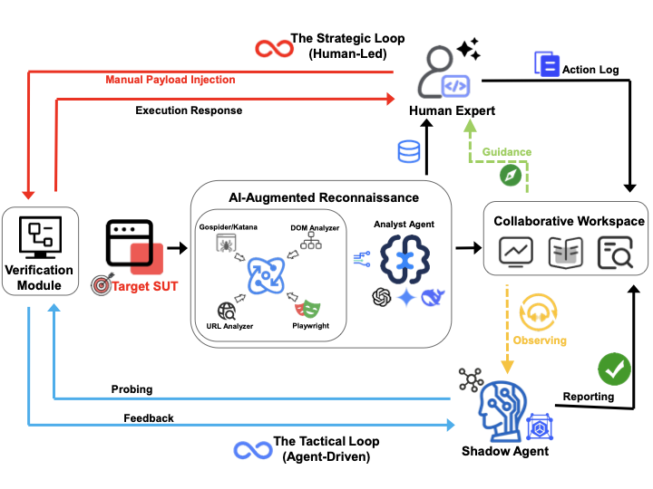

# 🛡️ ShadowPen

[](https://github.com)
[](LICENSE)
[](https://www.python.org)

**ShadowPen** is an intelligent XSS testing platform that combines a human-guided testing workflow with an LLM-powered Shadow Agent. It crawls a target application, extracts attack surfaces, ranks likely injection points, and helps generate payload mutations during testing.

This repository also includes a benchmark suite of intentionally vulnerable web applications for research and educational evaluation.

> Research repository for:  
> *ShadowPen: Synergizing Human Strategy with Proactive Shadow Agent for XSS Testing*  
> Accepted by **CSCWD 2026**.

## 📚 Contents

- [✨ Features](#features)
- [🏗️ Architecture](#architecture)
- [📁 Repository Layout](#repository-layout)
- [🚀 Quick Start](#quick-start)
- [🧪 Benchmark Apps](#benchmark-apps)
- [🛠️ Manual Development Setup](#manual-development-setup)
- [🧯 Troubleshooting](#troubleshooting)
- [⚖️ Responsible Use](#responsible-use)
- [📌 Research Notes](#research-notes)
- [📝 Citation](#citation)
- [📄 License](#license)

## ✨ Features

- **🕷️ Hybrid crawling**: GoSpider for URL discovery and Playwright for dynamic, state-aware browser exploration.
- **🎯 Attack surface extraction**: URL parameters, forms, DOM inputs, API requests, and interaction-triggered requests.
- **🧠 LLM analysis**: Ranks discovered surfaces and identifies high-value XSS candidates.
- **🧬 Payload mutation**: Generates context-aware variants using encoding, obfuscation, alternate tags, and polyglot patterns.
- **🧑‍💻 Shadow Agent UI**: A Vue 3 workflow with live testing feedback and an assistant panel.
- **🧪 Benchmark suite**: Ten vulnerable applications across Python, PHP, Go, Java, Node.js, Ruby, React, and Vue stacks.

## 🏗️ Architecture

<p align="center">
  
</p>

ShadowPen is organized as a layered human-in-the-loop testing system. The frontend guides the analyst through the workflow, the backend coordinates crawling and analysis, and the Shadow Agent uses the current testing context to prioritize surfaces and mutate payloads.

### 🧩 Component Map

| Layer | Module | Role |
| --- | --- | --- |
| 🖥️ Interface | Vue 3 frontend | Provides the 4-step testing workflow, result review, payload testing UI, and Shadow Agent panel. |
| ⚙️ API service | FastAPI backend | Exposes crawl, analysis, verification, chat, and WebSocket notification endpoints. |
| 🕷️ Discovery | GoSpider wrapper | Performs fast URL and asset discovery before browser-based exploration. |
| 🎭 Dynamic exploration | Playwright engine | Opens pages, waits for client-side rendering, simulates interactions, and exposes hidden states. |
| 🔎 Surface analysis | URL, DOM, and traffic analyzers | Extracts parameters from URLs, forms, DOM elements, and captured network requests. |
| 🧠 Shadow model | LLM analysis and mutation | Ranks attack surfaces, explains risk, and generates payload variants. |
| 🧪 Targets | Benchmark apps | Provide intentionally vulnerable applications for controlled evaluation. |

### 🔄 Execution Flow

```text
🧑 Analyst
  │
  ▼
🖥️ Vue Workflow
  │  Target URL, selected surface, payload
  ▼
⚙️ FastAPI Orchestrator
  │
  ├─▶ 🕷️ GoSpider discovery
  │
  ├─▶ 🎭 Playwright interaction
  │      └─▶ 🔎 DOM + traffic extraction
  │
  ├─▶ 🧠 LLM surface ranking
  │
  └─▶ 🧬 Payload mutation + verification
         │
         ▼
🧑 Analyst reviews findings and continues testing
```

### 📡 Runtime Channels

| Channel | Used for |
| --- | --- |
| `HTTP REST` | Crawl requests, payload verification, LLM analysis, and chat messages. |
| `WebSocket` | Live Shadow Agent notifications and background mutation activity. |
| `Docker network / host.docker.internal` | Backend-to-target connectivity for local benchmark applications. |

### 🧭 Main Workflow

1. 🔗 Enter a target URL.
2. 🕷️ Crawl and interact with the target.
3. 🎯 Review discovered injection points.
4. 🧪 Test payloads and ask the Shadow Agent for mutations or guidance.

## 📁 Repository Layout

```text
.
├── ShadowPen/
│   ├── backend/
│   │   ├── main.py                         # FastAPI entrypoint
│   │   ├── crawler.py                      # XSS scanner orchestration
│   │   ├── attack_surface_analyzer.py      # LLM ranking and filtering
│   │   ├── llm.py                          # LLM API client
│   │   ├── scanner.py                      # Payload verification
│   │   ├── crawler_engine/
│   │   │   ├── analyzers/                  # DOM, traffic, URL, interaction analyzers
│   │   │   └── utils/                      # GoSpider wrapper, URL helpers, result writer
│   │   ├── Dockerfile
│   │   └── requirements.txt
│   ├── frontend/
│   │   ├── src/
│   │   │   ├── App.vue
│   │   │   └── components/                 # 4-step scanning UI and Shadow panel
│   │   ├── Dockerfile
│   │   └── package.json
│   ├── .env.example
│   └── docker-compose.yml
├── django_wiki/
├── flask_techNews/
├── go_ticket/
├── java_employee/
├── node_feedback/
├── php_blog/
├── react_fastapi_social/
├── react_node_task/
├── ruby_gallery/
└── vue_spring_shop/
```

## 🚀 Quick Start

### 🔐 1. Configure ShadowPen

```bash
cd ShadowPen
cp .env.example .env
```

Edit `ShadowPen/.env`:

```env
BASE_URL=https://api.openai.com/v1
API_KEY=your-api-key-here
MODEL=gpt-4o-mini
```

Any OpenAI-compatible chat-completions endpoint can be used as long as `BASE_URL`, `API_KEY`, and `MODEL` match that provider.

### ▶️ 2. Start ShadowPen

```bash
docker compose up -d --build
```

Open:

- Frontend: http://localhost:5173
- Backend docs: http://localhost:8000/docs

### 🎯 3. Start a Benchmark Target

Example: PHP blog benchmark.

```bash
cd ../php_blog
docker compose up -d --build
```

Scan it from ShadowPen with:

```text
http://host.docker.internal:8081
```

On Docker Desktop, `host.docker.internal` lets the backend container reach services published on the host machine. Container-name access, such as `http://vulnerable_blog:80`, only works after both containers are on the same Docker network.

## 🧪 Benchmark Apps

These applications are intentionally vulnerable and should only be used in isolated local environments.

Run the table commands from the repository root.

| App | Stack | Start command | Host URL |
| --- | --- | --- | --- |
| `django_wiki` | Django + SQLite | `cd django_wiki && docker compose up -d --build` | `http://localhost:8080` |
| `flask_techNews` | Flask | `cd flask_techNews && docker compose up -d --build` | `http://localhost:5000` |
| `go_ticket` | Go templates | `cd go_ticket && docker compose up -d --build` | `http://localhost:8080` |
| `java_employee` | Spring Boot | `cd java_employee && docker compose up -d --build` | `http://localhost:8080` |
| `node_feedback` | Express + EJS | `cd node_feedback && docker compose up -d --build` | `http://localhost:8082` |
| `php_blog` | PHP | `cd php_blog && docker compose up -d --build` | `http://localhost:8081` |
| `react_fastapi_social` | React + FastAPI | `cd react_fastapi_social && docker compose up -d --build` | `http://localhost:3007` |
| `react_node_task` | React + Node.js | `cd react_node_task && docker compose up -d --build` | `http://localhost:8084` |
| `ruby_gallery` | Ruby | `cd ruby_gallery && docker compose up -d --build` | `http://localhost:4567` |
| `vue_spring_shop` | Vue + Spring Boot | `cd vue_spring_shop && docker compose up -d --build` | `http://localhost:3009` |

Several benchmark apps publish the same host port, especially `8080`. Run one of those at a time or change the port mapping before starting another.

## 🛠️ Manual Development Setup

Docker is the recommended path because the backend needs GoSpider, Playwright, and browser dependencies. For local development, use the following setup.

### ⚙️ Backend

```bash
cd ShadowPen/backend
python3 -m venv .venv
source .venv/bin/activate
pip install -r requirements.txt

go install github.com/jaeles-project/gospider@latest
python -m playwright install chromium

uvicorn main:app --host 0.0.0.0 --port 8000 --reload
```

The backend reads LLM settings from `ShadowPen/.env`.

### 🖥️ Frontend

```bash
cd ShadowPen/frontend
npm install
npm run dev -- --host
```

## 🧯 Troubleshooting

### 🧱 `Exec format error: /app/.../bin/gospider`

This usually happens after moving the project between Windows, Linux, and macOS, or between x86-64 and Apple Silicon machines. The checked-in `backend/bin/*` files may not match the container CPU architecture.

Fix:

```bash
cd ShadowPen
docker compose build --no-cache backend
docker compose up -d backend
```

The backend Docker build installs GoSpider inside the image and ignores `backend/bin/` during Docker builds.

### 🔗 Target URL becomes `http://http://...`

Enter a single scheme, for example:

```text
http://vulnerable_blog:80
```

The backend also normalizes common mistakes such as duplicate `http://` prefixes.

### 🌐 ShadowPen cannot reach a benchmark app

Try one of these target URL forms:

```text
http://host.docker.internal:<published-port>
http://<container-name>:<container-port>
```

For `php_blog`, examples are:

```text
http://host.docker.internal:8081
http://vulnerable_blog:80
```

Host access works well on Docker Desktop. Container-name access requires compatible Docker networking:

```bash
docker network connect shadowpen_default vulnerable_blog
```

### 🧠 LLM status is inactive

Check `ShadowPen/.env`:

```env
BASE_URL=...
API_KEY=...
MODEL=...
```

Then restart the backend:

```bash
cd ShadowPen
docker compose restart backend
```

### ♻️ Rebuild everything from scratch

```bash
cd ShadowPen
docker compose down
docker compose up -d --build
```

## ⚖️ Responsible Use

- Use ShadowPen only on systems you own or are authorized to test.
- The benchmark applications contain intentional vulnerabilities.
- Do not expose the benchmark apps to the public internet.
- You are responsible for complying with applicable laws and policies.

## 📌 Research Notes

ShadowPen is designed to study human-AI collaboration in security testing:

- **Human-in-the-loop testing** keeps strategic decisions with the analyst.
- **State-aware discovery** combines static URL discovery with browser-based interaction.
- **LLM prioritization** reduces noise by ranking surfaces before manual testing.
- **Adaptive mutation** generates payload variants based on testing context.

## 📝 Citation

If you use ShadowPen or the benchmark suite in research, please cite:

```bibtex
@inproceedings{shadowpen2026,
  title={ShadowPen: Synergizing Human Strategy with Proactive Shadow Agent for XSS Testing},
  author={Jianguo Wu, Yakai Li, Kexin Hao, Zhaojing Yuan, Luping Ma, Weijuan Zhang, Yi Su, Qingjia Huang},
  booktitle={Proceedings of the 29th International Conference on Computer Supported Cooperative Work in Design (CSCWD)},
  year={2026},
  organization={IEEE}
}
```

## 📄 License

This project is licensed under the MIT License. See [LICENSE](LICENSE) for details.
